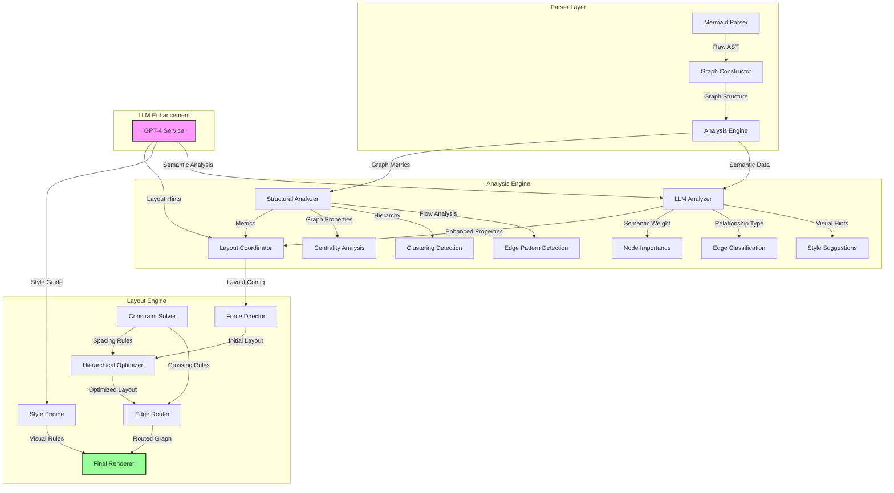

Let me break down the core technical challenges and approach for automated diagram layout enhancement.

1. Core Data Structures & Algorithms:

AST Structure:
```typescript
type Node = {
  id: string;
  type: 'node' | 'subgraph' | 'edge';
  label: string;
  children?: Node[];
  metadata?: {
    style: StyleProps;
    position?: Position;
    importance: number;  // LLM-assigned weight
  }
}

type Edge = {
  source: string;
  target: string;
  type: 'normal' | 'emphasis' | 'subflow';
  label?: string;
}

type Graph = {
  nodes: Node[];
  edges: Edge[];
  subgraphs: Node[];
}
```

2. Layout Pipeline:

a) Analysis Phase:
- Graph theoretic metrics (centrality, clustering)
- Hierarchical structure detection
- Edge crossing minimization
- LLM-guided importance weighting

b) Layout Algorithm:
```python
def optimize_layout(graph: Graph, constraints: LayoutConstraints):
    # 1. Initial force-directed layout
    positions = force_directed_layout(graph)
    
    # 2. Apply hierarchical constraints
    levels = analyze_hierarchy(graph)
    positions = adjust_for_hierarchy(positions, levels)
    
    # 3. LLM enhancement
    importance_weights = get_llm_importance_weights(graph)
    positions = optimize_by_importance(positions, importance_weights)
    
    # 4. Edge routing optimization
    edge_paths = optimize_edge_routing(positions, graph.edges)
    
    return LayoutResult(positions, edge_paths)
```

3. LLM Integration:

The LLM's role is crucial for:
- Understanding semantic relationships
- Suggesting visual hierarchy
- Optimizing layout aesthetics
- Maintaining domain conventions

Here's a more detailed architectural proposal:



Implementation Approach:

1. Graph Processing:
```typescript
class LayoutProcessor {
  private graph: Graph;
  private llm: LLMService;
  private layoutEngine: LayoutEngine;
  
  async enhanceLayout() {
    // 1. Analyze graph structure
    const metrics = this.analyzeStructure();
    
    // 2. Get LLM insights
    const semanticHints = await this.llm.analyzeGraph(this.graph);
    
    // 3. Apply layout algorithm
    const initialLayout = this.layoutEngine.computeBaseLayout(
      this.graph,
      metrics
    );
    
    // 4. Enhance with LLM suggestions
    const enhancedLayout = await this.llm.optimizeLayout(
      initialLayout,
      semanticHints
    );
    
    // 5. Final optimization
    return this.layoutEngine.finalizeLayout(enhancedLayout);
  }
}
```

2. LLM Integration:
```typescript
class LLMService {
  async analyzeGraph(graph: Graph): Promise<SemanticAnalysis> {
    const prompt = this.buildGraphAnalysisPrompt(graph);
    const response = await this.llm.complete(prompt);
    return this.parseSemanticSuggestions(response);
  }
  
  async optimizeLayout(
    layout: Layout,
    hints: SemanticAnalysis
  ): Promise<EnhancedLayout> {
    // Apply semantic understanding to layout
    return this.applySemanticEnhancements(layout, hints);
  }
}
```

The key innovations here are:
1. Hybrid layout algorithm combining force-directed and hierarchical approaches
2. LLM-guided importance weighting affecting node positioning
3. Semantic understanding of diagram purpose affecting layout decisions
4. Constraint solving for maintaining aesthetic rules
5. Edge routing optimization for clarity
Would you like me to elaborate on any particular component or show more detailed implementation examples?
