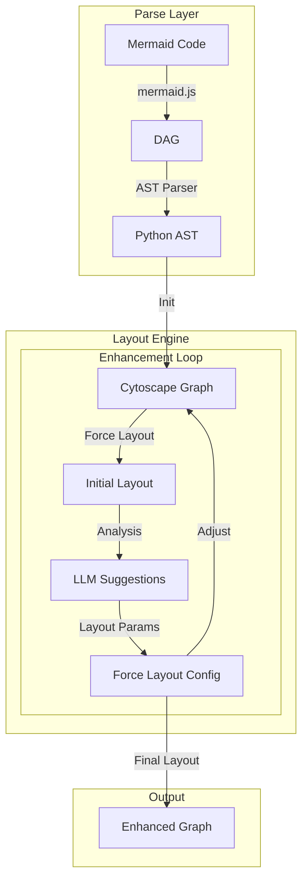

Ah yes, you're right - let's refocus on the core layout engine integration. Here's a revised approach:

1. Initial Setup:
```bash
mkdir mermaid-enhance
cd mermaid-enhance

# We'll need both Node and Python environments
npm init -y
npm install mermaid @ts-morph/ast

python -m venv venv
source venv/bin/activate
pip install fastapi uvicorn python-cytoscape openai
```

2. Core Pipeline Structure:



3. Implementation Approach:

```python
# core.py
from fastapi import FastAPI
import cy
from openai import OpenAI

class LayoutEngine:
    def __init__(self):
        self.cy = cy.Cytoscape()  # Python Cytoscape binding
        self.llm = OpenAI()
        
    async def process_diagram(self, mermaid_code: str):
        # 1. Use Node.js bridge to parse Mermaid
        dag = await self.parse_mermaid(mermaid_code)
        
        # 2. Convert to Cytoscape graph
        cy_graph = self.init_cytoscape_graph(dag)
        
        # 3. Initial force-directed layout
        layout = self.apply_force_layout(cy_graph)
        
        # 4. Enhancement loop
        for _ in range(3):  # Start with fixed iterations
            # Analyze current layout
            analysis = self.analyze_layout(layout)
            
            # Get LLM suggestions
            suggestions = await self.get_llm_suggestions(analysis)
            
            # Update layout parameters
            layout_params = self.update_layout_params(suggestions)
            
            # Reapply force layout with new params
            layout = self.apply_force_layout(cy_graph, layout_params)
        
        return self.generate_output(layout)
    
    def apply_force_layout(self, graph, params=None):
        if params is None:
            params = {
                'name': 'cola',  # or 'cose' - Cytoscape force-directed layouts
                'nodeSpacing': 100,
                'edgeElasticity': 100,
                'idealEdgeLength': 100
            }
        
        return self.cy.layout.run(params)
    
    async def get_llm_suggestions(self, analysis):
        prompt = f"""
        Analyze this graph layout:
        Nodes: {analysis['nodes']}
        Edge Crossings: {analysis['crossings']}
        Clustering Coefficient: {analysis['clustering']}
        
        Suggest improvements for:
        1. Node spacing
        2. Edge tensions
        3. Cluster separation
        4. Force parameters
        """
        
        response = await self.llm.chat.completions.create(
            model="gpt-4",
            messages=[{"role": "user", "content": prompt}]
        )
        
        return self.parse_layout_suggestions(response)
```

4. Node.js Bridge for Mermaid Parsing:
```javascript
// mermaid_parser.js
const mermaid = require('mermaid');

async function parseMermaidToDAG(code) {
    const dag = await mermaid.parse(code);
    return {
        nodes: dag.nodes.map(n => ({
            id: n.id,
            label: n.label,
            type: n.type
        })),
        edges: dag.edges.map(e => ({
            source: e.source,
            target: e.target,
            type: e.type
        }))
    };
}

module.exports = { parseMermaidToDAG };
```

5. Python-Node Bridge:
```python
# bridge.py
import asyncio
import json
from subprocess import PIPE, Popen

async def parse_mermaid(code: str):
    proc = Popen(['node', 'parse_mermaid.js'], 
                 stdin=PIPE, stdout=PIPE)
    
    stdout, _ = proc.communicate(input=code.encode())
    return json.loads(stdout)
```

Key Focus Areas:
1. Get Mermaid parsing working first (using mermaid.js)
2. Setup Cytoscape force layout integration
3. Implement basic LLM-guided layout enhancement loop
4. Focus on force layout parameter tuning

The core innovation here is the iterative enhancement loop where:
1. Force layout generates initial positions
2. LLM analyzes the layout quality
3. Layout parameters are adjusted based on LLM suggestions
4. Process repeats until satisfactory

Next steps would be:
1. Implement basic prototype with this structure
2. Add metrics for layout quality assessment
3. Refine LLM prompts for better layout suggestions
4. Add visualization feedback for debugging

Would you like me to elaborate on any particular component or show more detailed implementation code?
