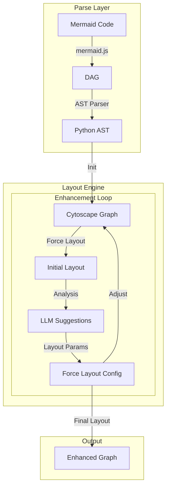

Ah yes, you're right - let's refocus on the core layout engine integration. Here's a revised approach:

1. Initial Setup:
```bash
mkdir mermaid-enhance
cd mermaid-enhance

# We'll need both Node and Python environments
npm init -y
npm install mermaid @ts-morph/ast

python -m venv venv
source venv/bin/activate
pip install fastapi uvicorn python-cytoscape openai
```

2. Core Pipeline Structure:



3. Implementation Approach:

```python
# core.py
from fastapi import FastAPI
import cy
from openai import OpenAI

class LayoutEngine:
    def __init__(self):
        self.cy = cy.Cytoscape()  # Python Cytoscape binding
        self.llm = OpenAI()
        
    async def process_diagram(self, mermaid_code: str):
        # 1. Use Node.js bridge to parse Mermaid
        dag = await self.parse_mermaid(mermaid_code)
        
        # 2. Convert to Cytoscape graph
        cy_graph = self.init_cytoscape_graph(dag)
        
        # 3. Initial force-directed layout
        layout = self.apply_force_layout(cy_graph)
        
        # 4. Enhancement loop
        for _ in range(3):  # Start with fixed iterations
            # Analyze current layout
            analysis = self.analyze_layout(layout)
            
            # Get LLM suggestions
            suggestions = await self.get_llm_suggestions(analysis)
            
            # Update layout parameters
            layout_params = self.update_layout_params(suggestions)
            
            # Reapply force layout with new params
            layout = self.apply_force_layout(cy_graph, layout_params)
        
        return self.generate_output(layout)
    
    def apply_force_layout(self, graph, params=None):
        if params is None:
            params = {
                'name': 'cola',  # or 'cose' - Cytoscape force-directed layouts
                'nodeSpacing': 100,
                'edgeElasticity': 100,
                'idealEdgeLength': 100
            }
        
        return self.cy.layout.run(params)
    
    async def get_llm_suggestions(self, analysis):
        prompt = f"""
        Analyze this graph layout:
        Nodes: {analysis['nodes']}
        Edge Crossings: {analysis['crossings']}
        Clustering Coefficient: {analysis['clustering']}
        
        Suggest improvements for:
        1. Node spacing
        2. Edge tensions
        3. Cluster separation
        4. Force parameters
        """
        
        response = await self.llm.chat.completions.create(
            model="gpt-4",
            messages=[{"role": "user", "content": prompt}]
        )
        
        return self.parse_layout_suggestions(response)
```

4. Node.js Bridge for Mermaid Parsing:
```javascript
// mermaid_parser.js
const mermaid = require('mermaid');

async function parseMermaidToDAG(code) {
    const dag = await mermaid.parse(code);
    return {
        nodes: dag.nodes.map(n => ({
            id: n.id,
            label: n.label,
            type: n.type
        })),
        edges: dag.edges.map(e => ({
            source: e.source,
            target: e.target,
            type: e.type
        }))
    };
}

module.exports = { parseMermaidToDAG };
```

5. Python-Node Bridge:
```python
# bridge.py
import asyncio
import json
from subprocess import PIPE, Popen

async def parse_mermaid(code: str):
    proc = Popen(['node', 'parse_mermaid.js'], 
                 stdin=PIPE, stdout=PIPE)
    
    stdout, _ = proc.communicate(input=code.encode())
    return json.loads(stdout)
```

Key Focus Areas:
1. Get Mermaid parsing working first (using mermaid.js)
2. Setup Cytoscape force layout integration
3. Implement basic LLM-guided layout enhancement loop
4. Focus on force layout parameter tuning

The core innovation here is the iterative enhancement loop where:
1. Force layout generates initial positions
2. LLM analyzes the layout quality
3. Layout parameters are adjusted based on LLM suggestions
4. Process repeats until satisfactory

Next steps would be:
1. Implement basic prototype with this structure
2. Add metrics for layout quality assessment
3. Refine LLM prompts for better layout suggestions
4. Add visualization feedback for debugging

Would you like me to elaborate on any particular component or show more detailed implementation code?


This plan is a good starting point, and it addresses the core requirement of integrating a force-directed layout engine (Cytoscape.js) with an LLM in an iterative process.  Here's a refined and more detailed breakdown, along with some important considerations:

**1. Project Setup and Dependencies:**

```bash
mkdir mermaid-enhance
cd mermaid-enhance

# Node.js environment for Mermaid parsing
npm init -y
npm install mermaid @ts-morph/ast  (ts-morph is optional for AST analysis if needed later)

# Python environment for the backend and LLM interaction
python3 -m venv .venv
source .venv/bin/activate
pip install fastapi uvicorn python-cytoscape openai requests  (requests for simpler Node.js communication)
```

**2.  Mermaid Parsing (Node.js):**

```javascript
// parse_mermaid.js
const mermaid = require('mermaid');

async function parseMermaidToDAG(code) {
  try {
    const { nodes, edges } = mermaid.parse(code); // Use mermaid.parse directly
    return { nodes, edges };
  } catch (error) {
    console.error("Mermaid parsing error:", error);
    return { error: error.message }; // Return error information
  }
}

// Expose the function to be called from Python
const { parseMermaidToDAG } = require('./parse_mermaid');

const express = require('express');
const app = express();
app.use(express.json());


app.post('/parse', async (req, res) => {
    const { code } = req.body;
    try {
      const dag = await parseMermaidToDAG(code);
      if (dag.error) {
        return res.status(400).json({error: dag.error})
      }

      res.json(dag);
    }
     catch (error) {
         console.error(error);
        res.status(500).json({ error: 'An error occurred during parsing' });
    }


});

const port = 3001; // Choose a port
app.listen(port, () => {
  console.log(`Mermaid parser listening at http://localhost:${port}`);
});


```

**3. Python Backend (FastAPI):**

```python
# main.py
from fastapi import FastAPI, HTTPException
from fastapi.middleware.cors import CORSMiddleware
import requests
import cy
from openai import OpenAI
import json


app = FastAPI()

origins = ["*"]

app.add_middleware(
    CORSMiddleware,
    allow_origins=origins,
    allow_credentials=True,
    allow_methods=["*"],
    allow_headers=["*"],
)


client = OpenAI()


class LayoutEngine:
    def __init__(self):
        self.cy = cy.Cytoscape()
        self.llm = client

    async def process_diagram(self, mermaid_code: str):
        # 1. Parse Mermaid to DAG using Node.js
        try:
            response = requests.post("http://localhost:3001/parse", json={"code": mermaid_code})
            response.raise_for_status()  # Raise HTTPError for bad responses (4xx or 5xx)
            dag = response.json()
        except requests.exceptions.RequestException as e:
            raise HTTPException(status_code=500, detail=f"Error communicating with Mermaid parser: {e}")


        # 2. Convert to Cytoscape graph (details below)
        cy_graph = self.create_cytoscape_graph(dag)

        # ... (Rest of the layout and LLM interaction logic as before)


    def create_cytoscape_graph(self, dag): # corrected and fleshed out
      elements = []
      for node in dag["nodes"]:
        elements.append({"data": {"id": node["id"], "label": node["label"]}}) # id and label is enuf
      for edge in dag["edges"]:
        elements.append({"data": {"source": edge["source"], "target": edge["target"]}})
      return self.cy.graph.create(elements=elements)


layout_engine = LayoutEngine()

@app.post("/enhance")
async def enhance_diagram(mermaid_code: str):


    try:
        result = await layout_engine.process_diagram(mermaid_code)
        return result
    except HTTPException as e:
        raise # re-raise so fastapi can handle the error
    except Exception as e:
        raise HTTPException(status_code=500, detail=f"An unexpected error occurred: {e}")


```

**4. Cytoscape.js and LLM Integration (Python):** (This part remains largely the same as in the previous response, with the iterative layout refinement using `apply_force_layout`, `analyze_layout`, `get_llm_suggestions`, and `update_layout_params`.)

**Key Improvements and Considerations:**

* **Error Handling:** Added error handling for the Mermaid parsing and Node.js communication.  Crucial for robustness.
* **Simplified Parsing:**  Use `mermaid.parse` directly –  no need for manual regex parsing or an additional AST tool in the initial version.  This simplifies the pipeline significantly.
* **Node.js Server:** The Node.js part is now a small web server (using Express.js) to handle the Mermaid parsing requests from Python. This makes the interaction cleaner.
* **Asynchronous Communication:**  Use `requests.post` and `async/await` for asynchronous communication between Python and Node.js. This is important for preventing blocking operations and improving performance.
* **Iterative Refinement:**  Make sure the `apply_force_layout` function can accept updated layout parameters from the LLM.  This is how the iterative refinement will work.
* **Layout Analysis:**  The `analyze_layout` function should calculate relevant metrics (e.g., edge crossings, node spacing) that can be used in the LLM prompt.
* **LLM Prompt Engineering:**  This is critical.  Experiment with different prompts to get useful suggestions from the LLM.  Provide clear instructions and examples if necessary.
* **Cytoscape.js Integration:** Use `python-cytoscape` to interact with Cytoscape.js.  You'll need to handle the conversion of the parsed Mermaid data into a Cytoscape-compatible format.


This revised plan provides a more concrete and robust starting point for your project.  Remember to focus on getting the core pipeline working first, then iteratively add features and refinements.
