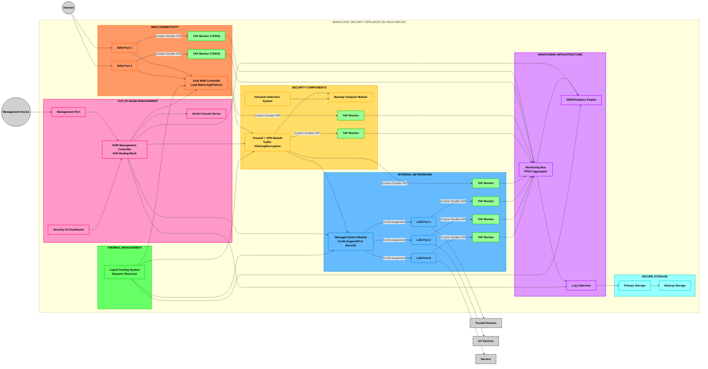

```mermaid
flowchart LR
    subgraph MONOLITHIC_APPLIANCE["MONOLITHIC SECURITY APPLIANCE (2U RACK MOUNT)"]
        direction TB

        %% WAN SECTION
        subgraph WAN["WAN CONNECTIVITY"]
            WAN1["WAN Port 1"]
            WAN2["WAN Port 2"]
            WANController["Dual WAN Controller<br>Load Balancing/Failover"]
            WAN1 --> |"Custom Double-TAP"| WANTap1["TAP Monitor (TX/RX)"]
            WAN2 --> |"Custom Double-TAP"| WANTap2["TAP Monitor (TX/RX)"]
            WAN1 --> WANController
            WAN2 --> WANController
        end

        %% SECURITY COMPONENTS
        subgraph SECURITY["SECURITY COMPONENTS"]
            FirewallVPN["Firewall + VPN Module<br>Traffic Filtering/Encryption"]
            IDS["Intrusion Detection System"]
            BackupCompute["Backup Compute Module"]
            WANController --> |"Custom Double-TAP"| PostWANTap["TAP Monitor"]
            WANController --> FirewallVPN
            FirewallVPN --> |"Custom Double-TAP"| FirewallTap["TAP Monitor"]
            FirewallVPN --> BackupCompute
            IDS --> BackupCompute
        end

        %% INTERNAL SWITCHING
        subgraph INTERNAL["INTERNAL NETWORKING"]
            ManagedSwitch["Managed Switch Module<br>VLAN Support/Port Security"]
            FirewallVPN --> |"Custom Double-TAP"| PreSwitchTap["TAP Monitor"]
            FirewallVPN --> ManagedSwitch
            ManagedSwitch --> |"VLAN Assignment"| LAN1["LAN Port 1"]
            ManagedSwitch --> |"VLAN Assignment"| LAN2["LAN Port 2"]
            ManagedSwitch --> |"VLAN Assignment"| LAN8["LAN Port 8"]
            LAN1 --> |"Custom Double-TAP"| LANTap1["TAP Monitor"]
            LAN2 --> |"Custom Double-TAP"| LANTap2["TAP Monitor"]
            LAN8 --> |"Custom Double-TAP"| LANTap8["TAP Monitor"]
        end

        %% MONITORING INFRASTRUCTURE
        subgraph MONITOR["MONITORING INFRASTRUCTURE"]
            MonitoringBus["Monitoring Bus<br>FPGA Aggregator"]
            WANTap1 --> MonitoringBus
            WANTap2 --> MonitoringBus
            PostWANTap --> MonitoringBus
            FirewallTap --> MonitoringBus
            PreSwitchTap --> MonitoringBus
            LANTap1 --> MonitoringBus
            LANTap2 --> MonitoringBus
            LANTap8 --> MonitoringBus
            MonitoringBus --> SIEM["SIEM/Analytics Engine"]
            MonitoringBus --> Logger["Log Collection"]
        end

        %% OUT OF BAND MANAGEMENT
        subgraph OOB["OUT-OF-BAND MANAGEMENT"]
            OOBController["OOB Management Controller<br>Self-Healing Mesh"]
            SecConsole["Serial Console Server"]
            OOBInterface["Management Port"]
            OOBController --> WANController
            OOBController --> FirewallVPN
            OOBController --> ManagedSwitch
            OOBController --> SIEM
            OOBController --> Logger
            OOBController --> SecConsole
            OOBInterface --> OOBController
            UX["Security UX Dashboard"] --> OOBController
        end

        %% STORAGE
        subgraph STORAGE["SECURE STORAGE"]
            PrimaryStorage["Primary Storage"]
            BackupStorage["Backup Storage"]
            Logger --> PrimaryStorage
            PrimaryStorage --> BackupStorage
        end

        %% THERMAL MANAGEMENT
        subgraph THERMAL["THERMAL MANAGEMENT"]
            LiquidCooling["Liquid Cooling System<br>Dynamic Reservoir"]
            LiquidCooling --> WANController
            LiquidCooling --> FirewallVPN
            LiquidCooling --> ManagedSwitch
            LiquidCooling --> SIEM
        end
    end

    %% External connections
    Internet((Internet)) --> WAN1
    Internet((Internet)) --> WAN2
    LAN1 --> TrustedDevices["Trusted Devices"]
    LAN2 --> IoTDevices["IoT Devices"]
    LAN8 --> Servers["Servers"]
    Management((Management Device)) --> OOBInterface

    %% Styling
    classDef external fill:#d0d0d0,stroke:#606060,stroke-width:2px,color:#000000,font-weight:bold;
    classDef wan fill:#ff9966,stroke:#ff6600,stroke-width:2px,color:#000000,font-weight:bold;
    classDef security fill:#ffdd66,stroke:#ffaa00,stroke-width:2px,color:#000000,font-weight:bold;
    classDef internal fill:#66bbff,stroke:#0088cc,stroke-width:2px,color:#000000,font-weight:bold;
    classDef taps fill:#99ff99,stroke:#00cc00,stroke-width:2px,color:#000000,font-weight:bold;
    classDef monitoring fill:#dd99ff,stroke:#aa00ff,stroke-width:2px,color:#000000,font-weight:bold;
    classDef oob fill:#ff99cc,stroke:#ff0066,stroke-width:2px,color:#000000,font-weight:bold;
    classDef storage fill:#99ffff,stroke:#00cccc,stroke-width:2px,color:#000000,font-weight:bold;
    classDef thermal fill:#66ff66,stroke:#00cc00,stroke-width:2px,color:#000000,font-weight:bold;

    class Internet,Management,TrustedDevices,IoTDevices,Servers external;
    class WAN,WAN1,WAN2,WANController wan;
    class SECURITY,FirewallVPN,IDS,BackupCompute security;
    class INTERNAL,ManagedSwitch,LAN1,LAN2,LAN8 internal;
    class WANTap1,WANTap2,PostWANTap,FirewallTap,PreSwitchTap,LANTap1,LANTap2,LANTap8 taps;
    class MONITOR,MonitoringBus,SIEM,Logger monitoring;
    class OOB,OOBController,SecConsole,OOBInterface,UX oob;
    class STORAGE,PrimaryStorage,BackupStorage storage;
    class THERMAL,LiquidCooling thermal;
```
