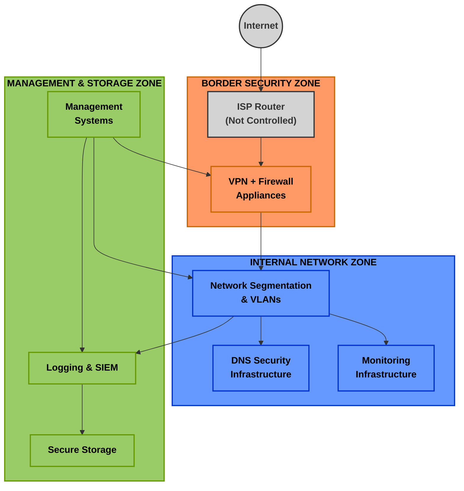
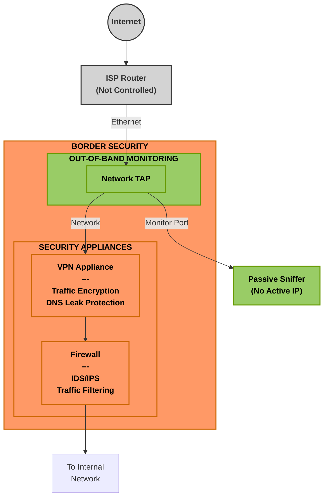
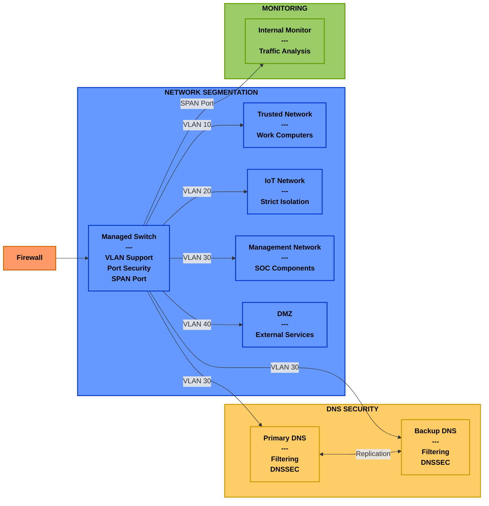
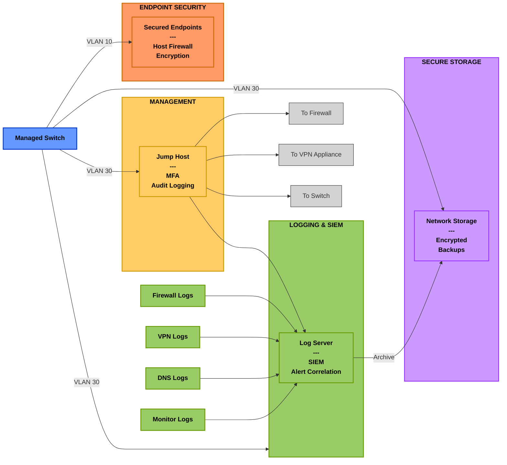

```mermaid
flowchart TD
    %% External Components
    Internet((Internet)) --> ISPRouter["ISP Router\n(Not Controlled)"]
    
    %% Main Areas
    subgraph BorderZone["BORDER SECURITY ZONE"]
        direction TB
        ISPRouter --> BorderSecurity["VPN + Firewall\nAppliances"]
    end
    
    subgraph InternalZone["INTERNAL NETWORK ZONE"]
        direction TB
        NetworkSegmentation["Network Segmentation\n& VLANs"]
        DNSSecurity["DNS Security\nInfrastructure"]
        Monitoring["Monitoring\nInfrastructure"]
    end
    
    subgraph ManagementZone["MANAGEMENT & STORAGE ZONE"]
        direction TB
        LoggingSIEM["Logging & SIEM"]
        SecureStorage["Secure Storage"]
        ManagementSystems["Management\nSystems"]
    end
    
    %% Connections between zones
    BorderSecurity --> NetworkSegmentation
    NetworkSegmentation --> DNSSecurity
    NetworkSegmentation --> Monitoring
    NetworkSegmentation --> LoggingSIEM
    LoggingSIEM --> SecureStorage
    ManagementSystems --> BorderSecurity
    ManagementSystems --> NetworkSegmentation
    ManagementSystems --> LoggingSIEM
    
    %% Styling
    classDef external fill:#D3D3D3,stroke:#333,stroke-width:2px,font-weight:bold;
    classDef border fill:#FF9966,stroke:#CC6600,stroke-width:2px,color:#000,font-weight:bold;
    classDef internal fill:#6699FF,stroke:#0033CC,stroke-width:2px,color:#000,font-weight:bold;
    classDef management fill:#99CC66,stroke:#669900,stroke-width:2px,color:#000,font-weight:bold;
    
    class Internet,ISPRouter external;
    class BorderZone,BorderSecurity border;
    class InternalZone,NetworkSegmentation,DNSSecurity,Monitoring internal;
    class ManagementZone,LoggingSIEM,SecureStorage,ManagementSystems management;
```

```mermaid
flowchart TD
    %% External Components
    Internet((Internet)) --> ISPRouter["ISP Router\n(Not Controlled)"]
    
    %% Border Security Components
    subgraph BorderSecurity["BORDER SECURITY"]
        direction TB
        
        subgraph OutOfBand["OUT-OF-BAND MONITORING"]
            NetworkTap["Network TAP"]
        end
        
        subgraph SecurityAppliances["SECURITY APPLIANCES"]
            VPNAppliance["VPN Appliance\n---\nTraffic Encryption\nDNS Leak Protection"]
            Firewall["Firewall\n---\nIDS/IPS\nTraffic Filtering"]
        end
    end
    
    %% Connections
    ISPRouter --> |"Ethernet"| NetworkTap
    NetworkTap --> |"Monitor Port"| PassiveSniffer["Passive Sniffer\n(No Active IP)"]
    NetworkTap --> |"Network"| VPNAppliance
    VPNAppliance --> Firewall
    Firewall --> InternalNet["To Internal\nNetwork"]
    
    %% Styling
    classDef external fill:#D3D3D3,stroke:#333,stroke-width:2px,font-weight:bold;
    classDef border fill:#FF9966,stroke:#CC6600,stroke-width:2px,color:#000,font-weight:bold;
    classDef monitoring fill:#99CC66,stroke:#669900,stroke-width:2px,color:#000,font-weight:bold;
    
    class Internet,ISPRouter external;
    class BorderSecurity,SecurityAppliances,VPNAppliance,Firewall border;
    class OutOfBand,NetworkTap,PassiveSniffer monitoring;
```

```mermaid
flowchart LR
    %% Input from Border Security
    BorderFirewall["Firewall"] --> ManagedSwitch
    
    %% Network Segmentation Components
    subgraph NetworkSegmentation["NETWORK SEGMENTATION"]
        direction TB
        ManagedSwitch["Managed Switch\n---\nVLAN Support\nPort Security\nSPAN Port"]
        
        %% Network Segments
        ManagedSwitch --> |"VLAN 10"| TrustedNet["Trusted Network\n---\nWork Computers"]
        ManagedSwitch --> |"VLAN 20"| IOTNet["IoT Network\n---\nStrict Isolation"]
        ManagedSwitch --> |"VLAN 30"| AdminNet["Management Network\n---\nSOC Components"]
        ManagedSwitch --> |"VLAN 40"| DMZNet["DMZ\n---\nExternal Services"]
    end
    
    %% DNS Security Components
    subgraph DNSSecurity["DNS SECURITY"]
        direction TB
        PiHole1["Primary DNS\n---\nFiltering\nDNSSEC"]
        PiHole2["Backup DNS\n---\nFiltering\nDNSSEC"]
        PiHole1 <--> |"Replication"| PiHole2
    end
    
    %% Monitoring Components
    subgraph Monitoring["MONITORING"]
        direction TB
        InternalMonitor["Internal Monitor\n---\nTraffic Analysis"]
    end
    
    %% Connections
    ManagedSwitch --> |"VLAN 30"| PiHole1
    ManagedSwitch --> |"VLAN 30"| PiHole2
    ManagedSwitch --> |"SPAN Port"| InternalMonitor
    
    %% Styling
    classDef firewall fill:#FF9966,stroke:#CC6600,stroke-width:2px,color:#000,font-weight:bold;
    classDef network fill:#6699FF,stroke:#0033CC,stroke-width:2px,color:#000,font-weight:bold;
    classDef dns fill:#FFCC66,stroke:#CC9900,stroke-width:2px,color:#000,font-weight:bold;
    classDef monitoring fill:#99CC66,stroke:#669900,stroke-width:2px,color:#000,font-weight:bold;
    
    class BorderFirewall firewall;
    class NetworkSegmentation,ManagedSwitch,TrustedNet,IOTNet,AdminNet,DMZNet network;
    class DNSSecurity,PiHole1,PiHole2 dns;
    class Monitoring,InternalMonitor monitoring;
```

```mermaid
flowchart LR
    %% Input from Network
    NetworkSwitch["Managed Switch"] --> |"VLAN 30"| LoggingComponents
    
    %% Logging Components
    subgraph LoggingComponents["LOGGING & SIEM"]
        direction TB
        LogServer["Log Server\n---\nSIEM\nAlert Correlation"]
    end
    
    %% Storage Components
    subgraph StorageComponents["SECURE STORAGE"]
        direction TB
        NAS["Network Storage\n---\nEncrypted\nBackups"]
    end
    
    %% Management Components
    subgraph ManagementComponents["MANAGEMENT"]
        direction TB
        JumpHost["Jump Host\n---\nMFA\nAudit Logging"]
    end
    
    %% Endpoint Security
    subgraph Endpoints["ENDPOINT SECURITY"]
        direction TB
        SecuredEndpoints["Secured Endpoints\n---\nHost Firewall\nEncryption"]
    end
    
    %% Connections 
    NetworkSwitch --> |"VLAN 30"| JumpHost
    NetworkSwitch --> |"VLAN 30"| NAS
    NetworkSwitch --> |"VLAN 10"| SecuredEndpoints
    
    LogServer --> |"Archive"| NAS
    
    %% Management connections
    JumpHost --> LogServer
    JumpHost --> FirewallLink["To Firewall"]
    JumpHost --> VPNLink["To VPN Appliance"]
    JumpHost --> SwitchLink["To Switch"]
    
    %% Log sources
    FirewallLogs["Firewall Logs"] --> LogServer
    VPNLogs["VPN Logs"] --> LogServer
    DNSLogs["DNS Logs"] --> LogServer
    MonitorLogs["Monitor Logs"] --> LogServer
    
    %% Styling
    classDef network fill:#6699FF,stroke:#0033CC,stroke-width:2px,color:#000,font-weight:bold;
    classDef logging fill:#99CC66,stroke:#669900,stroke-width:2px,color:#000,font-weight:bold;
    classDef storage fill:#CC99FF,stroke:#9933FF,stroke-width:2px,color:#000,font-weight:bold;
    classDef management fill:#FFCC66,stroke:#CC9900,stroke-width:2px,color:#000,font-weight:bold;
    classDef endpoint fill:#FF9966,stroke:#CC6600,stroke-width:2px,color:#000,font-weight:bold;
    classDef external fill:#D3D3D3,stroke:#333,stroke-width:1px;
    
    class NetworkSwitch network;
    class LoggingComponents,LogServer,FirewallLogs,VPNLogs,DNSLogs,MonitorLogs logging;
    class StorageComponents,NAS storage;
    class ManagementComponents,JumpHost management;
    class Endpoints,SecuredEndpoints endpoint;
    class FirewallLink,VPNLink,SwitchLink external;
```
