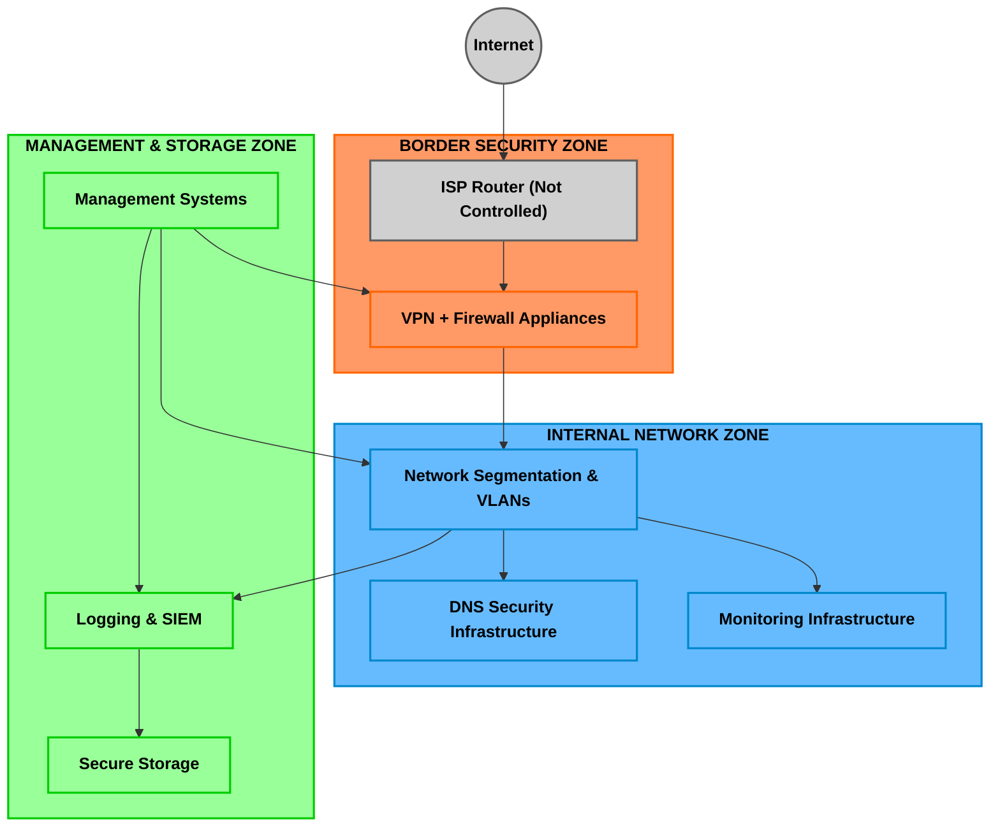
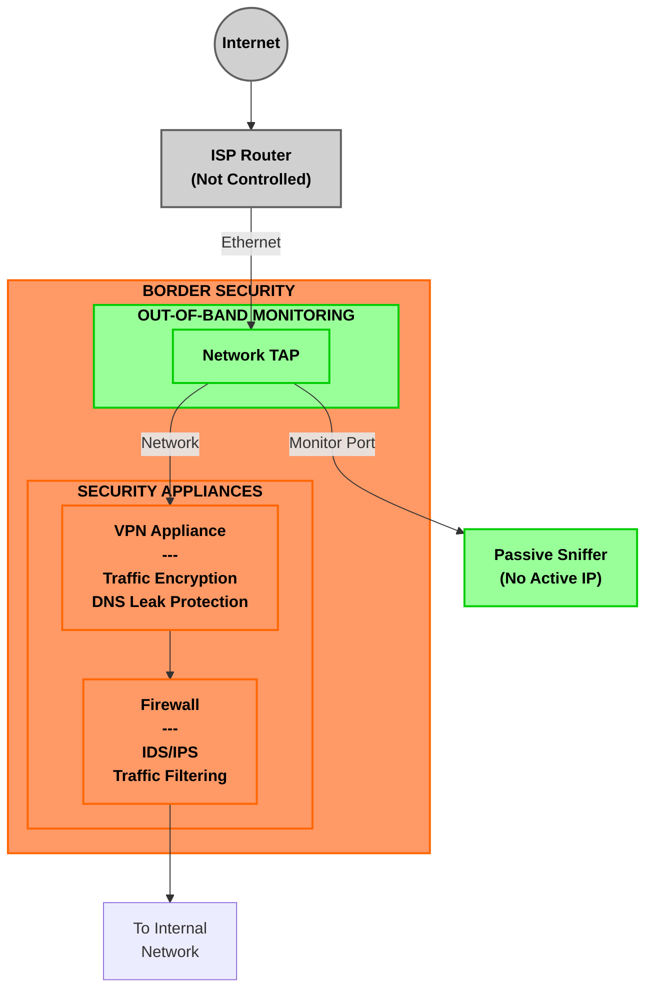
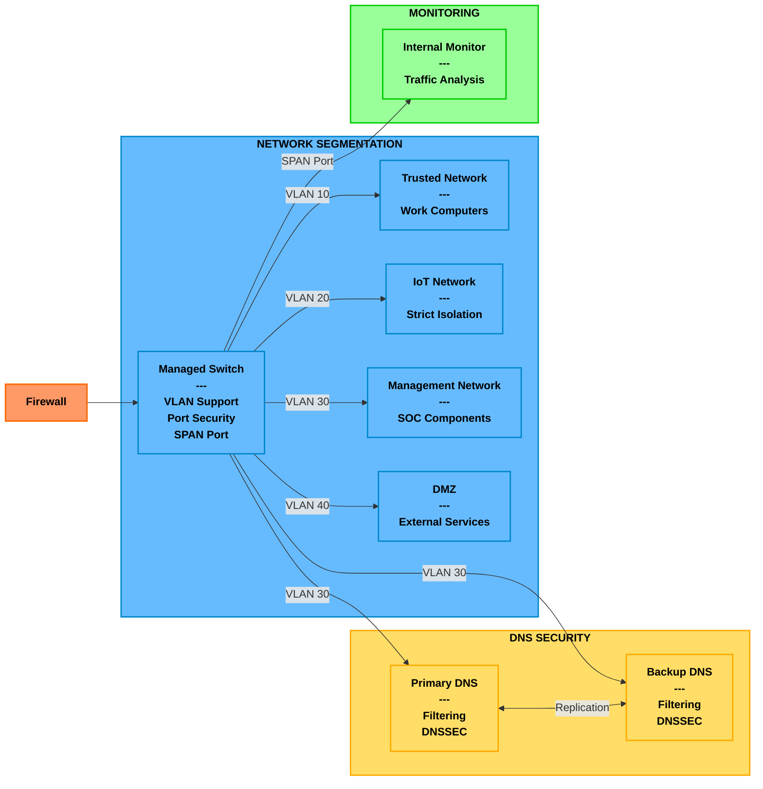
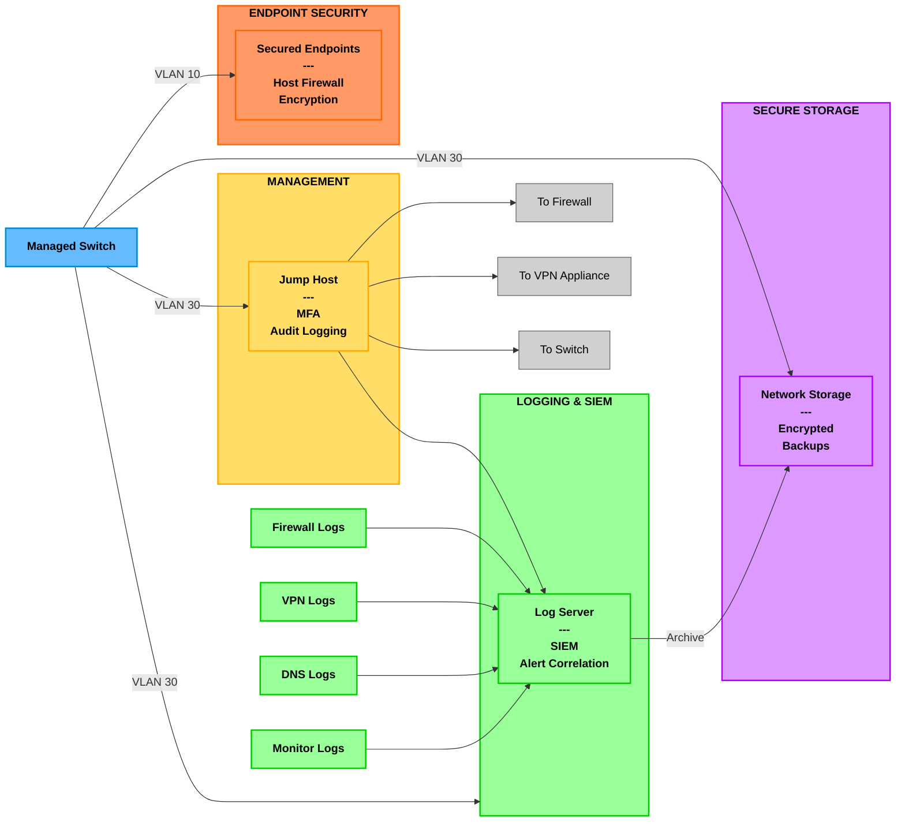

## Home Office SOC Architecture - Split into Focused Diagrams

### 1. High-Level Overview Diagram
This provides a bird's-eye view of the entire SOC architecture, showing the three main zones and their relationships:
- Border Security Zone (orange)
- Internal Network Zone (blue)
- Management & Storage Zone (green)

### 2. Border Security Components
This diagram focuses specifically on the security components at your network perimeter:
- ISP Router connection
- Network TAP for out-of-band monitoring
- VPN appliance for encrypted traffic
- Firewall for traffic filtering and IDS/IPS

### 3. Network Segmentation & Monitoring
This diagram shows the internal network structure:
- Managed switch with VLAN configuration
- The four separate network segments (Trusted, IoT, Management, DMZ)
- DNS security infrastructure
- Internal traffic monitoring

### 4. Management & Logging Infrastructure
This diagram details the management, logging, and storage components:
- Log server and SIEM
- Secure storage
- Jump host for secure management
- Endpoint security 
- Log flow from various sources

