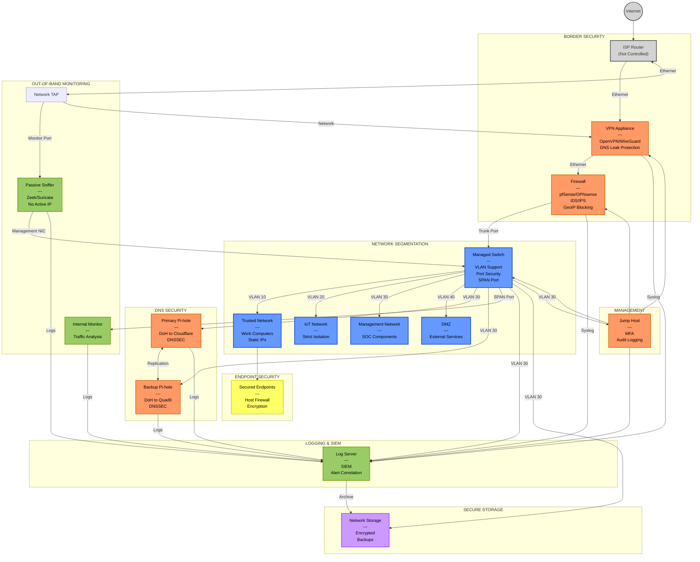

```mermaid
flowchart TD
    %% External Components
    Internet((Internet)) --> ISPRouter["ISP Router\n(Not Controlled)"]
    
    %% Border Security Layer
    subgraph BorderSecurity["BORDER SECURITY"]
        direction TB
        ISPRouter --> |"Ethernet"| VPNAppliance["VPN Appliance\n---\nOpenVPN/WireGuard\nDNS Leak Protection"]
        VPNAppliance --> |"Ethernet"| Firewall["Firewall\n---\npfSense/OPNsense\nIDS/IPS\nGeoIP Blocking"]
    end
    
    %% Network Segregation Layer
    subgraph NetworkSegregation["NETWORK SEGMENTATION"]
        direction TB
        Firewall --> |"Trunk Port"| ManagedSwitch["Managed Switch\n---\nVLAN Support\nPort Security\nSPAN Port"]
        
        ManagedSwitch --> |"VLAN 10"| TrustedNet["Trusted Network\n---\nWork Computers\nStatic IPs"]
        ManagedSwitch --> |"VLAN 20"| IOTNet["IoT Network\n---\nStrict Isolation"]
        ManagedSwitch --> |"VLAN 30"| AdminNet["Management Network\n---\nSOC Components"]
        ManagedSwitch --> |"VLAN 40"| DMZNet["DMZ\n---\nExternal Services"]
    end
    
    %% DNS Security Layer
    subgraph DNSSecurity["DNS SECURITY"]
        direction TB
        ManagedSwitch --> |"VLAN 30"| PiHole1["Primary Pi-hole\n---\nDoH to Cloudflare\nDNSSEC"]
        ManagedSwitch --> |"VLAN 30"| PiHole2["Backup Pi-hole\n---\nDoH to Quad9\nDNSSEC"]
        PiHole1 <--> |"Replication"| PiHole2
    end
    
    %% Out-of-Band Monitoring
    subgraph OOBMonitoring["OUT-OF-BAND MONITORING"]
        direction TB
        ISPRouter <--> |"Ethernet"| NetworkTap["Network TAP"]
        NetworkTap --> |"Monitor Port"| PassiveSniffer["Passive Sniffer\n---\nZeek/Suricata\nNo Active IP"]
        NetworkTap --> |"Network"| VPNAppliance
        
        PassiveSniffer --> |"Management NIC"| ManagedSwitch
        
        ManagedSwitch --> |"SPAN Port"| InternalMonitor["Internal Monitor\n---\nTraffic Analysis"]
    end
    
    %% Log Management & SIEM
    subgraph LogManagement["LOGGING & SIEM"]
        direction TB
        ManagedSwitch --> |"VLAN 30"| LogServer["Log Server\n---\nSIEM\nAlert Correlation"]
        
        Firewall --> |"Syslog"| LogServer
        VPNAppliance --> |"Syslog"| LogServer
        PiHole1 --> |"Logs"| LogServer
        PiHole2 --> |"Logs"| LogServer
        PassiveSniffer --> |"Logs"| LogServer
        InternalMonitor --> |"Logs"| LogServer
    end
    
    %% Storage
    subgraph SecureStorage["SECURE STORAGE"]
        direction TB
        ManagedSwitch --> |"VLAN 30"| NAS["Network Storage\n---\nEncrypted\nBackups"]
        
        LogServer --> |"Archive"| NAS
    end
    
    %% Management
    subgraph Management["MANAGEMENT"]
        direction TB
        ManagedSwitch --> |"VLAN 30"| JumpHost["Jump Host\n---\nMFA\nAudit Logging"]
        
        JumpHost --> Firewall
        JumpHost --> VPNAppliance
        JumpHost --> ManagedSwitch
        JumpHost --> LogServer
    end
    
    %% Endpoint Security
    subgraph EndpointSecurity["ENDPOINT SECURITY"]
        direction TB
        TrustedNet --> Endpoints["Secured Endpoints\n---\nHost Firewall\nEncryption"]
    end
    
    %% Legend and Styling
    classDef external fill:#D3D3D3,stroke:#333,stroke-width:2px;
    classDef security fill:#FF9966,stroke:#CC6600,stroke-width:2px,color:#000;
    classDef network fill:#6699FF,stroke:#0033CC,stroke-width:2px,color:#000;
    classDef monitoring fill:#99CC66,stroke:#669900,stroke-width:2px,color:#000;
    classDef storage fill:#CC99FF,stroke:#9933FF,stroke-width:2px,color:#000;
    classDef endpoint fill:#FFFF66,stroke:#CCCC00,stroke-width:2px,color:#000;
    
    class Internet,ISPRouter external;
    class VPNAppliance,Firewall,PiHole1,PiHole2,JumpHost security;
    class ManagedSwitch,TrustedNet,IOTNet,AdminNet,DMZNet network;
    class PassiveSniffer,InternalMonitor,LogServer monitoring;
    class NAS storage;
    class Endpoints endpoint;
    
    %% Apply bold formatting to section titles
    subgraph BorderSecurity["<b>BORDER SECURITY</b>"]
    end
    subgraph NetworkSegregation["<b>NETWORK SEGMENTATION</b>"]
    end
    subgraph DNSSecurity["<b>DNS SECURITY</b>"]
    end
    subgraph OOBMonitoring["<b>OUT-OF-BAND MONITORING</b>"]
    end
    subgraph LogManagement["<b>LOGGING & SIEM</b>"]
    end
    subgraph SecureStorage["<b>SECURE STORAGE</b>"]
    end
    subgraph Management["<b>MANAGEMENT</b>"]
    end
    subgraph EndpointSecurity["<b>ENDPOINT SECURITY</b>"]
    end
```
