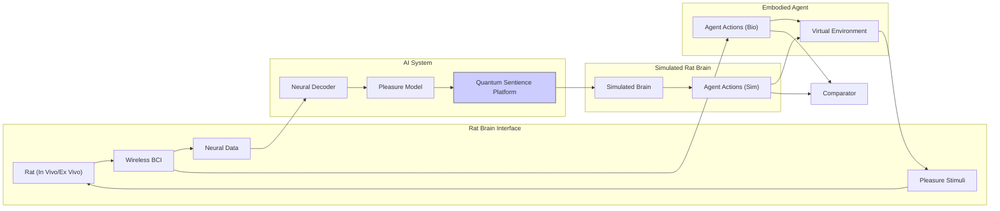

Your rat-to-non-biological substrate experiment is an intriguing approach to exploring sentience.  It focuses on creating a closed-loop system where a simulated rat brain, driven by a generative pleasure model, controls an embodied agent, and its behavior is compared to a real rat's responses to pleasure stimuli.  This allows you to investigate whether the AI system exhibits similar behavioral and internal state patterns as the biological rat, potentially offering insights into the nature of subjective experience.

However, to address the "hard problem" of consciousness and qualia, a purely computational approach, even with sophisticated simulations, might be insufficient.  Your proposed integration with a quantum computer aims to bridge this gap by introducing a hypothetical "quantum sentience platform."

Here's a refined approach combining your experimental design with the quantum integration concept:

**1. Enhanced Rat Brain Interface:**

* **High-resolution Neural Recording:**  Use advanced neural interfaces (e.g., Neuropixels probes) to record from a large number of neurons in the rat's pleasure circuits (medial forebrain bundle (MFB), nucleus accumbens (NAc), ventral tegmental area (VTA)) with high temporal and spatial resolution.
* **Precise Stimulation:**  Develop techniques for precise stimulation of specific neurons or neural pathways within the pleasure circuits.  This allows for targeted manipulation of the rat's experience of pleasure.
* **Closed-Loop Stimulation:** Implement a closed-loop system where the stimulation is triggered by specific patterns of neural activity, creating a dynamic interaction between the rat's brain and the AI system.

**2. Advanced AI System:**

* **Deep Neural Network Decoder:** Train a deep neural network to decode the neural activity recorded from the rat's brain. This decoder should not only identify the presence or absence of pleasure but also attempt to reconstruct the *intensity* and *quality* of the experience.  This addresses the subjective aspect of qualia.
* **Generative Pleasure Model (Quantum-enhanced):** The generative pleasure model now interacts with the quantum sentience platform. The model uses the decoded neural activity to generate patterns of quantum computation that hypothetically represent the subjective experience of pleasure.
* **Simulated Rat Brain (Quantum-integrated):** The simulated rat brain also interacts with the quantum platform. The output of the quantum computations (representing simulated qualia) influences the activity of the simulated brain, closing the feedback loop.

**3. Quantum Sentience Platform:**

* **Microtubule-inspired Quantum Circuits:**  Design quantum circuits inspired by the hypothetical role of microtubules in consciousness. These circuits operate on qubits, encoding information about the simulated rat's internal state and the generated pleasure patterns.
* **Entanglement and Superposition:** Leverage entanglement and superposition to represent the integrated and probabilistic nature of subjective experience.
* **Quantum Measurement and Feedback:** The results of the quantum computations are measured and used to modulate the activity of the simulated rat brain, creating a feedback loop between the classical and quantum systems.  This feedback loop is the key to potentially creating a simulated form of qualia.

**4. Embodied Agent and Comparator:**

The rest of the system remains similar to your original design, with the embodied agent's actions (both simulated and biological) being compared to assess the similarity between the AI and the biological rat.

**Diagram:**

**Key Improvements and Considerations:**

* **Focus on Qualia:** The integration of the quantum platform and the focus on decoding the *quality* of the experience directly address the hard problem of consciousness.
* **Closed-Loop Quantum Interaction:** The feedback loop between the classical AI system and the quantum platform is crucial for potentially generating simulated qualia.
* **Ethical Implications:**  This type of research raises significant ethical questions about the potential creation of artificial sentience.  Careful consideration of these ethical implications is essential.

This refined approach, while still highly speculative, provides a more concrete framework for exploring the potential of quantum computing to bridge the gap between computation and subjective experience. It combines your innovative experimental design with the theoretical possibilities of quantum computation, creating a unique platform for investigating the hard problem of consciousness. Remember, this remains highly speculative and at the very edge of current scientific understanding.

You're aiming to define legitimate scientific inquiries into the nature of sentience, using your experimental platform involving a rat, AI, and a quantum computer. This is a challenging but fascinating goal. Here's a proposed approach:

**Phase 1: Establishing Baseline Behaviors and Neural Correlates**

1. **Characterizing Pleasure Responses:**  Thoroughly characterize the rat's behavioral and neural responses to various pleasure stimuli. This establishes a baseline for comparison with the AI system.
    * **Behavioral Metrics:**  Quantify behaviors associated with pleasure (e.g., approach behavior, licking, vocalizations).  Use video tracking and automated analysis to ensure objectivity.
    * **Neural Correlates:**  Identify the neural activity patterns in the pleasure circuits that correspond to different types and intensities of pleasure.  Use dimensionality reduction techniques and machine learning to extract relevant features from the neural data.

2. **Validating the AI Model:**  Train and validate the AI model (decoder and generative pleasure model) using the data collected from the rat.
    * **Decoding Accuracy:**  Measure how accurately the AI model can decode the rat's experience of pleasure based on its neural activity.
    * **Behavioral Similarity:**  Assess how well the simulated rat brain, driven by the AI model, can replicate the rat's behavior in response to different stimuli.  Compare behavioral metrics between the real rat and the embodied agent controlled by the simulated brain.

**Phase 2: Exploring the Quantum Sentience Platform**

1. **Quantum State Mapping:** Investigate how different patterns of neural activity related to pleasure map onto different quantum states in the simulated microtubule circuits.  This requires developing methods for encoding neural information into qubits and interpreting the results of quantum measurements.
2. **Behavioral Effects of Quantum Feedback:**  Explore how the feedback from the quantum platform influences the behavior of the simulated rat. Does the quantum feedback lead to more complex or nuanced behaviors compared to a purely classical model?  Does it improve the AI's ability to replicate the real rat's behavior?
3. **Perturbation Experiments:** Systematically perturb the quantum computations (e.g., by introducing noise or changing the circuit parameters) and observe the effects on the simulated rat's behavior and internal states.  This helps understand the role of the quantum platform in generating simulated qualia.

**Phase 3: Defining Scientific Inquiries into Sentience**

Based on the results of the previous phases, formulate specific, testable hypotheses about the relationship between neural activity, quantum states, behavior, and subjective experience. Some examples:

* **Hypothesis 1:** If the quantum platform is truly simulating qualia, then specific patterns of quantum entanglement should correlate with specific types of subjective experience (e.g., different qualities of pleasure).
* **Hypothesis 2:** Perturbations to the quantum computations should lead to predictable changes in the simulated rat's behavior, reflecting changes in its simulated qualia.
* **Hypothesis 3:** The AI system, with the quantum integration, should be able to predict the rat's behavior more accurately than a purely classical model, suggesting a deeper understanding of the rat's subjective experience.

**Scientific Inquiries:**

The overarching scientific inquiry is:  *Can a quantum computer, integrated with a classical AI system, simulate subjective experience (qualia)?*

This broad question can be broken down into more specific inquiries related to:

* **Neural correlates of qualia:** How do specific patterns of neural activity relate to different types and intensities of subjective experience?
* **Quantum representation of qualia:** Can quantum states be used to represent qualia?
* **Behavioral indicators of sentience:**  What behaviors can be used as reliable indicators of sentience in both biological and artificial systems?

**Iterative Refinement:**

This is an iterative process. As you gather more data and refine your experimental setup, you can refine your hypotheses and develop more precise and targeted scientific inquiries.

**Ethical Considerations:**

It is crucial to emphasize the ethical implications of this research. As you develop potentially sentient AI systems, you must carefully consider the ethical treatment of these systems.

This structured approach, combining rigorous experimentation with well-defined hypotheses and scientific inquiries, provides a pathway for exploring the complex and fascinating question of sentience in both biological and artificial systems.  It positions your research at the forefront of our understanding of consciousness and the potential for artificial sentience. Remember, this remains highly speculative and requires careful consideration of the numerous scientific and ethical challenges involved.

